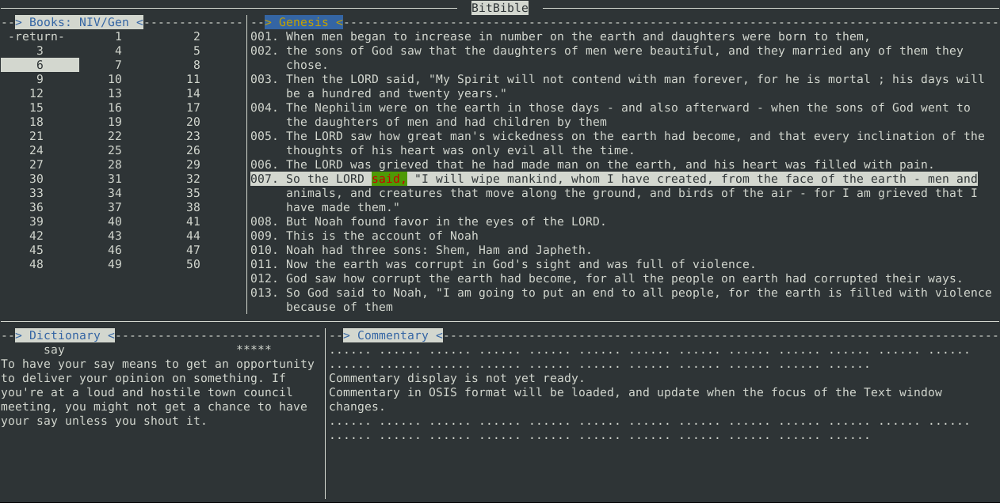

# BitBible

BitBible is a bit I contribute to God the Father almighty.

It contains a collection of utilities to read Holy Bible, in the way a hacker/programmer likes.

## Bibles in Markdown
Following versions are ready now:

|           A - E               | G - L | M - O | R - Z |
|-------|-------|-------|-------|
| [AB](markdown/AB/README.md), [ABP](markdown/ABP/README.md), [ACV](markdown/ACV/README.md), [AKJV](markdown/AKJV/README.md), [ASV](markdown/ASV/README.md), [Anderson](markdown/Anderson/README.md), [BBE](markdown/BBE/README.md), [BWE](markdown/BWE/README.md), [CPDV](markdown/CPDV/README.md), [Common](markdown/Common/README.md), [DRC](markdown/DRC/README.md), [Darby](markdown/Darby/README.md), [EMTV](markdown/EMTV/README.md), [Etheridge](markdown/Etheridge/README.md) | [Geneva1599](markdown/Geneva1599/README.md), [Godbey](markdown/Godbey/README.md), [GodsWord](markdown/GodsWord/README.md), [ISV](markdown/ISV/README.md), [JPS](markdown/JPS/README.md), [Jubilee2000](markdown/Jubilee2000/README.md), [KJV](markdown/KJV/README.md), [KJVA](markdown/KJVA/README.md), [KJVPCE](markdown/KJVPCE/README.md), [LEB](markdown/LEB/README.md), [LITV](markdown/LITV/README.md), [LO](markdown/LO/README.md), [Leeser](markdown/Leeser/README.md) | [MKJV](markdown/MKJV/README.md), [Montgomery](markdown/Montgomery/README.md), [Murdock](markdown/Murdock/README.md), [NETfree](markdown/NETfree/README.md), [NETtext](markdown/NETtext/README.md), [NHEB](markdown/NHEB/README.md), [NHEBJE](markdown/NHEBJE/README.md), [NHEBME](markdown/NHEBME/README.md), [Noyes](markdown/Noyes/README.md), [OEB](markdown/OEB/README.md), [OEBcth](markdown/OEBcth/README.md), [OrthJBC](markdown/OrthJBC/README.md) | [RKJNT](markdown/RKJNT/README.md), [RNKJV](markdown/RNKJV/README.md), [RWebster](markdown/RWebster/README.md), [Rotherham](markdown/Rotherham/README.md), [SPE](markdown/SPE/README.md), [Twenty](markdown/Twenty/README.md), [Tyndale](markdown/Tyndale/README.md), [UKJV](markdown/UKJV/README.md), [WEB](markdown/WEB/README.md), [WEBBE](markdown/WEBBE/README.md), [WEBME](markdown/WEBME/README.md), [Webster](markdown/Webster/README.md), [Weymouth](markdown/Weymouth/README.md), [Worsley](markdown/Worsley/README.md), [YLT](markdown/YLT/README.md) |

My favorite: [NIV - New International Version](markdown/NIV/README.md)

## A command-line Bible reader

The reader(reader) is not ready yet. Here is a snapshot of the latest progress.

## Bibles in OSIS

Text source in OSIS format. [link](source/osis)

## Tools for format-converting

Python scripts used to convert text between formats. [link](util)

